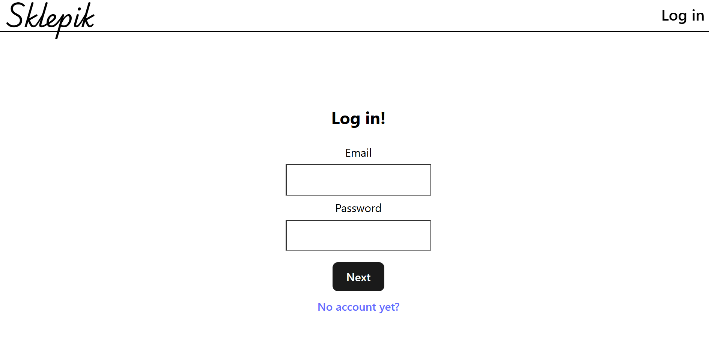
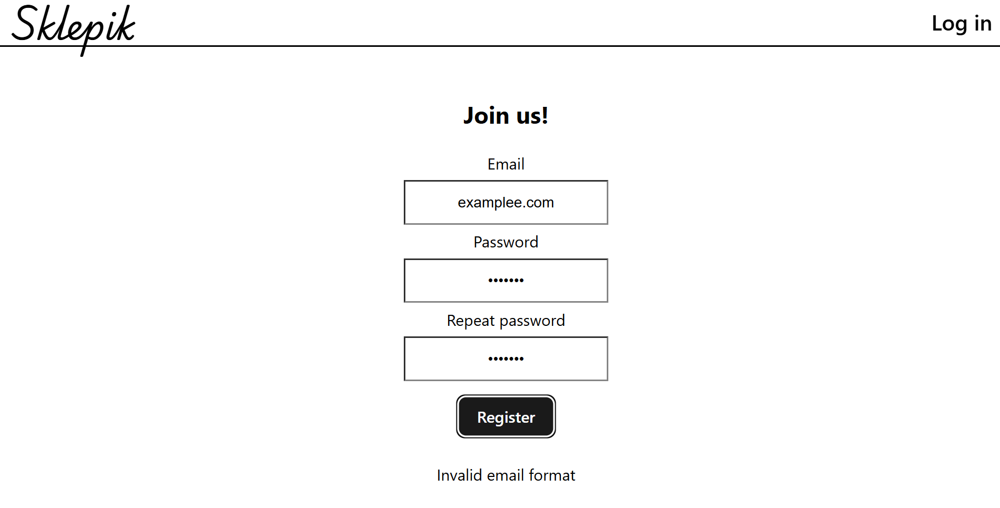
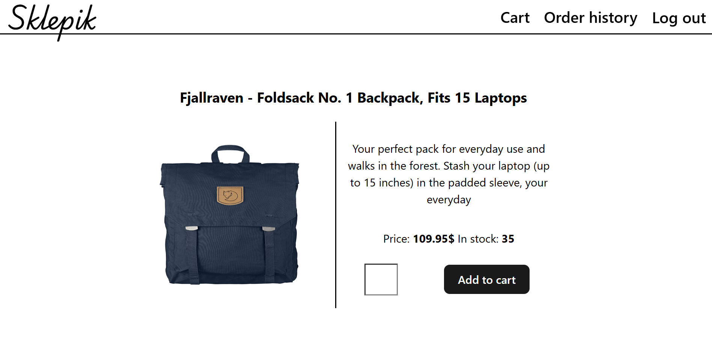
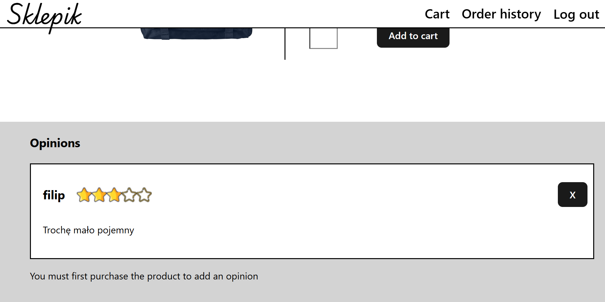
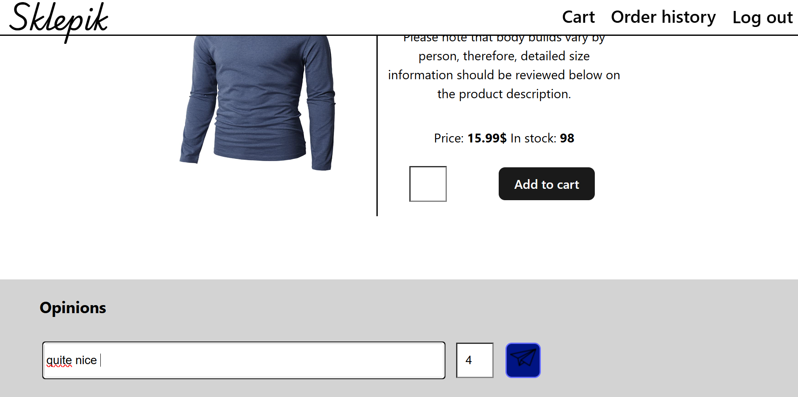
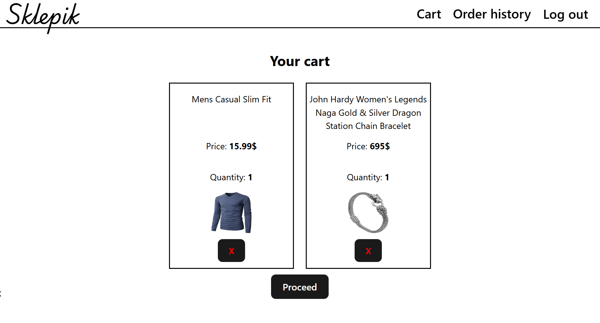
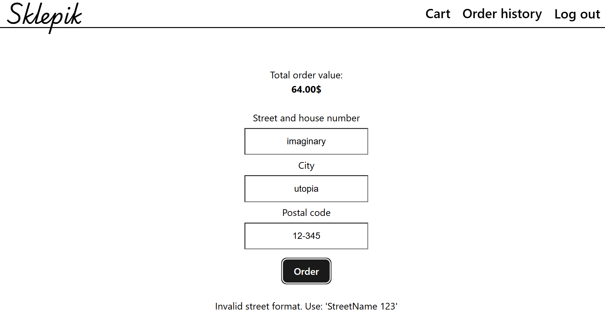
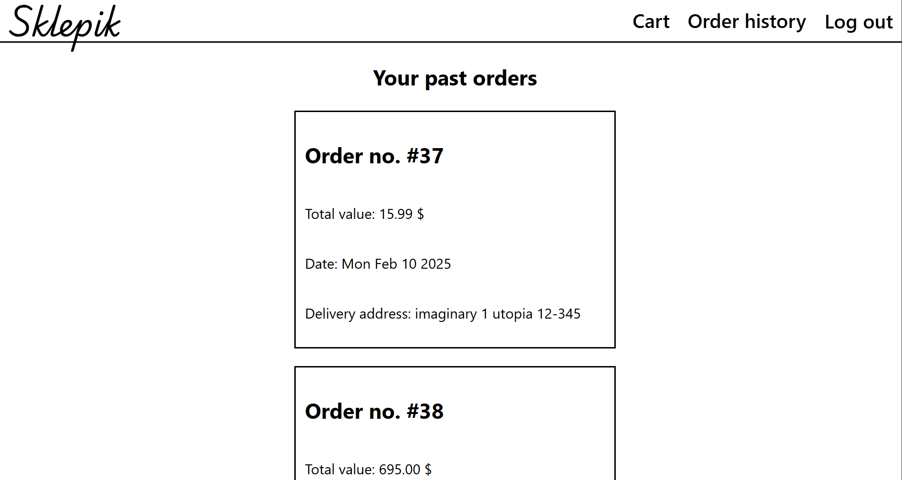

# Sklepik Web Store

Sklepik is a React app for online shopping with Express server made in Typescript and with SQLite database. JSONWebToken was used for authentication and authorization.

## Login and registration

There is data validation. If user is correctly registered, his password is hashed with Bcrypt and saved in database with email and default user role code.

### Authentication

After login, access token and refresh token are created with JSON Web Token.  
Refresh token is saved in database, and access token is kept in state in React using Context.  
On Express side there is middleware for verifying token and role.

## Main page

You can browse all products by name or category.  
 

You can delete your own opinions, admin can delete all.  
 

Only after you've bought the product you can add an opinion.

## Orders

### Cart

### Order details

Order data validation.

### Order history

